.. PixhawkPi_Drone_IIT_Goa documentation master file, created by
   sphinx-quickstart on Thu May 23 14:50:09 2024.
   You can adapt this file completely to your liking, but it should at least
   contain the root `toctree` directive.

Welcome to PixhawkPi Drone IIT Goa's documentation!
===================================================
This is the Official Documentation of the Raspberry Pi + Pixhawk Quadcopter of IIT Goa.
The purpose of the quadcopter is to perform GPS autonomous missions with the ability to run onboard image processing/computer vision tasks.
The Drone can be used for Aerial survey, mapping, and, Aerial survelance tasks.

Outline
=======
Bill Of Materials
Hardware 
Software
Build videos
Step-By-Step Guide

Bill Of Materials (BOM)
=======================

The google sheet for the Drone Components is linked here - `link <https://docs.google.com/spreadsheets/d/1WMJ0JZHKSVvVYk9KxNpKaOY2RGXc1wVU0DR-9mmTaPo/edit#gid=0>`_

.. list-table:: Drone Parts List
   :header-rows: 1

   * - Drone Parts
     - Quantity
     - Total Cost
     - Source
   * - Frame F450
     - 1
     - 814.15
     - https://robu.in/product/q450-quadcopter-framepcb-version-with-integrated-pcb-plastic-landing-gear-combo-kit-2/
   * - Orange 3S Lipo Battery 5200 mAh
     - 1
     - 2878
     - https://robu.in/product/orange-5200mah-3s-40c80c-lithium-polymer-battery-pack-lipo/
   * - ESC simonk 30A
     - 4
     - 1380
     - https://robu.in/product/30a-bldc-esc-electronic-speed-controller/
   * - BLDC Motors CW ready to sky
     - 2
     - 1084
     - https://robu.in/product/2212-920kv-brushless-motor-dji-cw/
   * - BLDC Motors CCW ready to sky
     - 2
     - 1210
     - https://robu.in/product/2212-920kv-brushless-motor-dji-red/
   * - Props 1045 ABS
     - 3 sets
     - 534
     - https://robu.in/product/orange-hd-propellers-104510x4-5-abs-dji-black-2cw2ccw-2pair-premium-quality/
   * - Pixhawk FC
     - 1
     - 10999
     - https://robu.in/product/pixhawk-px4-autopilot-pix-2-4-8-32-bit-flight-controller/
   * - Pixhawk power module
     - 1
     - 433
     - https://robu.in/product/apm-2-5-2-apm-2-6-pixhawk-power-module-v1-0-output-bec-3a-xt60-plug-28v-90a/
   * - Anti-Vibration damper
     - 2
     - 354
     - https://robu.in/product/glass-fiber-flight-controller-anti-vibration-set-shock-absorber-apmkkmwc/
   * - GPS Neo M8N
     - 1
     - 2299
     - https://robu.in/product/ublox-neo-m8n-gps-for-apm-and-pixhawk-flight-controller/
   * - GPS folding stand
     - 1
     - 245
     - https://robu.in/product/universal-gps-folding-antenna-base-setblack/
   * - Telemetry 100mW
     - 1
     - 6325
     - https://robu.in/product/433mhz-telemetry-100mw/#reviews
   * - Radio Transmitter FS-i6X 10ch receiver
     - 1
     - 4805
     - https://robu.in/product/flysky-fs-i6x-2-4ghz-10ch-afhds-2a-rc-transmitter-with-fs-ia10b-2-4ghz-10ch-receiver/
   * - Battery Voltage checker
     - 1
     - 159
     - https://robu.in/product/lipo-battery-voltage-checker-1s-8s-with-buzzer/
   * - Lipo Battery charger
     - 1
     - 3323.1
     - https://robu.in/product/skyrc-imax-b6-50w-5a-chargerdischarger-1-6-cells-dc-5a-12v-60w-adapter-acgenuine/
   * - Fireproof Lipo bag
     - 1
     - 199
     - https://robu.in/product/230mmx300mm-lipo-battery-guard-bag/
   * - Battery velcrow strap
     - 1
     - 55
     - https://robu.in/product/30cm-lipo-battery-strap-belt-reusable-cable-tie-wrap/
   * - XT 60 connector Female
     - 1
     - 39
     - https://robu.in/product/xt60h-connector-with-housing-male/
   * - T connector Female
     - 4
     - 120
     - https://robu.in/product/t-style-female-connector-with-insulating-cap-1pcs/
   * - 16 AWG silicon wire red
     - 1
     - 69
     - https://robu.in/product/high-quality-16awg-silicon-black-wire-1m/
   * - servo wire
     - 1
     - 38
     - https://robu.in/product/1jr-male-2-futaba-female-y-type-servo-extension-wire-100mm/
   * - Zip ties
     - 1 set
     - 109
     - https://www.amazon.in/Globomotive-Premium-Nylon-Locking-Pieces/dp/B08GKPWLB9/ref=sr_1_5?dib=eyJ2IjoiMSJ9.tTLsV89xK4NBy2Ce3ztJNllMOn-6v86MgheatP6qzasNJ5SbYbwPzxGbtMqPW6vm6aSceAzHZZysYi8B-gjM1zp4Brxjob_mwv5mi0y0kE1fWfLt3fMlMmyvVOXNsshjCpdC_Vv3s2-mnkJuJO5RmO-VVUDzdOLOYp9ysxAWqLsiE4-F2YKsIsBhp_yGarWpC8agjzFWuymPILTtIVgGdowMBlHBlCP6qnUbVJxMM_ye1XzFWC3-QxujOC4k2-dETmplD6GlooMxulOBEi1xpNLTr-jCYF2NJQSz2z9U0I8.IvRoHNFwfHGx2sFdPywIUYLHe0GRSgtT5wtBWuoFUec&dib_tag=se&keywords=zip+ties&qid=1708781880&sr=8-5
   * - 3M double sided tape
     - 1
     - 145
     - https://www.amazon.in/Scotch-Double-Foam-Tape-24/dp/B00N1U9AJS/ref=sr_1_5?crid=1FXPXSWAE8FKD&dib=eyJ2IjoiMSJ9.GL8kZAQfxsDoFVROayomVCuXwC7E3Ox75uvRNDaJj2TQKWEtfAX2UbozJhj27kSNeVeSzhqdysmmIH0UG4NGuebz3O_Kjj6zt4M_Cg_p0C2WZsgrvFpzwBJhjgT0fRDPomi28mQ_kq3VP9JppJM_N8eqcWGpjvcJ63A-aLYYjrZyy2f5HHmOY4nuCttq3bWOHxwhfWCjpLxUoTbBFDO81FQ0oINNbT2WXOARjiyCfBeIjoZ-HmxI1FjGwjObAEA2ByrzmoiZ-uSxMIoMAPdegJ0lGHg4ueO1BdnLryTznMA.fxO7feJ_orS0EKWBCypqpGjgRAEktZEjgGHb-aZ_mNU&dib_tag=se&keywords=3m+double+sided+tape&qid=1708781949&sprefix=3m+double+sided+tap%2Caps%2C356&sr=8-5
   * - Jumper wires
     - 1 set
     - 112.1
     - https://robu.in/product/20-cm-40-pin-dupont-male-male-male-female-female-female-cable-combo/
   * - AA battery 4 set
     - 1 pack
     - 99
     - https://www.amazon.in/Duracell-Chota-Power-Alkaline-Batteries/dp/B08KWHQTBG/ref=sr_1_14?crid=2ICMTHJKP7J0E&dib=eyJ2IjoiMSJ9.ZMfsh7UXYFni413Sf_ZUUL5sJkd9gsEuaUkVVjmB5YaR

Hardware
========

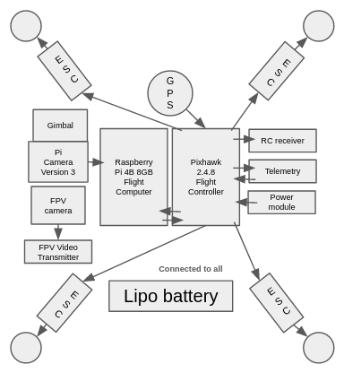

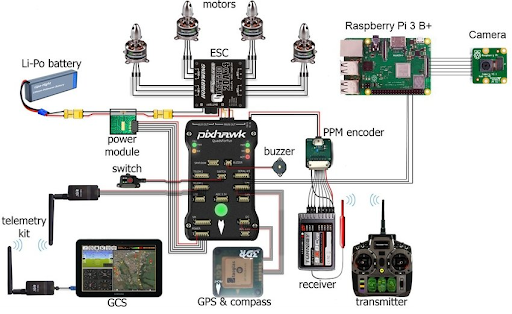

Flight Controler Hardware - Pixhawk 2.4.8
-----------------------------------------

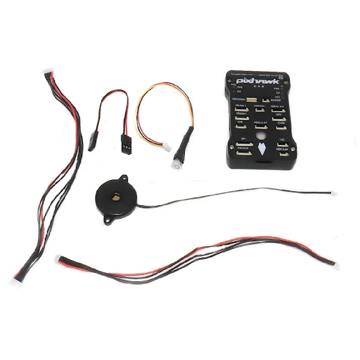

This is an old open source flight controller hardware that is no longer manufactured by the original manufacturer. As the designs were open source any manufacturer can build these and are still selling these. This reduces the prices but quality assurance is not the best as these hardware may come with issues sometimes. This is a really popular flight control hardware for building a GPS autonomous quadcopter on a budget. This comes with a set of wires, safety switch, and a buzzer. 

GPS - Ublox Neo M8N
-------------------

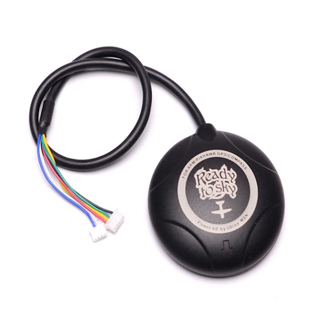

This GPS module includes a UBlox M8N GPS and a Compass (Magnetometer). This GPS sensor is also not new but it is cheaper and I don’t recommend going for even older GPS sensors like M7N or M6N. You should only look for UBlox M8N or more. These sensors also may have issues because of lack of quality assurance so should be tested with pixhawk to see if we are able to sense more than 0 satellites and if the compass is working.

Telemetry - 100mW 915Mhz radio Telemetry
----------------------------------------

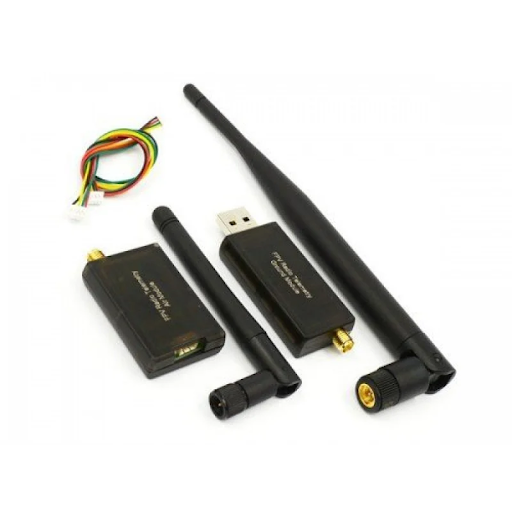

This is a 915MHz low powered (100mW) telemetry system that supports the MAVLink communication protocol. It is expected to give a max range of 1KM in line of sight but this depends upon antenna and other factors so if you need more range you might want to look for higher powered ones. You need to install a Silicon labs driver on your windows OS (video - How to Fix 3DR Telemetry Radio Link Problem). Once installed you will be able to open the com port for telemetry.

Autopilot Firmware - Ardupilot Arducopter (latest) Pixhawk
----------------------------------------------------------

On your Mission Planner software we by default should get the option of Ardupilot’s latest Arducopter firmware in our case it was 4.5.1 for the Pixhawk 1 hardware category. If your hardware sensor is giving problems with the latest firmware you should try uploading an older version like 4.0.1 etc. In most cases the latest firmware should work.
Arducopter documentation - https://ardupilot.org/copter/

Ground Control Software - Mission Planner
-----------------------------------------

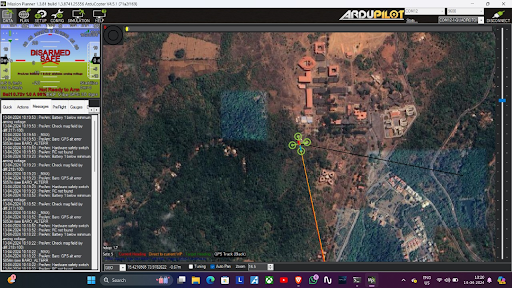

This is a multipurpose software we can upload autopilot firmware, calibrate the sensors, debug the issues, and also plan GPS autonomous missions. Apart from Mission planner QGround Control software can also be used for the same purpose. The softwares communicates with the UAV hardware by sending MAVlink messages over the Telemetry radio. 

Transmitter - FlySky FS i6X10ch
-------------------------------

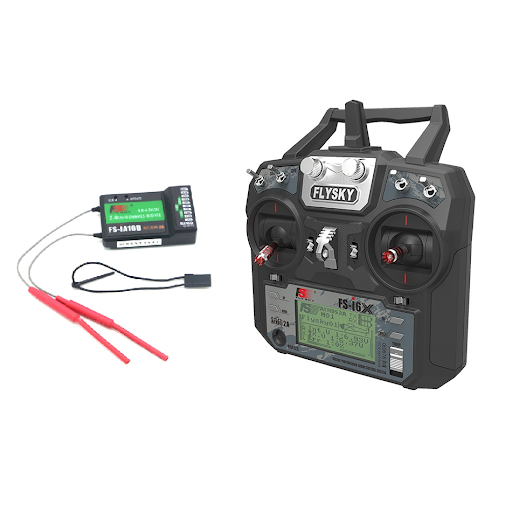

This is a good Transmitter receiver for autonomous UAVs as it is a budget Transmitter offering 10 channels and many switches that can be configured easily.

Flight Computer - Raspberry Pi 4B 8GB
-------------------------------------

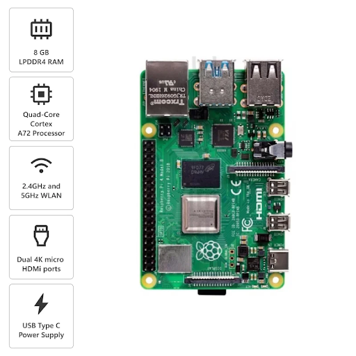
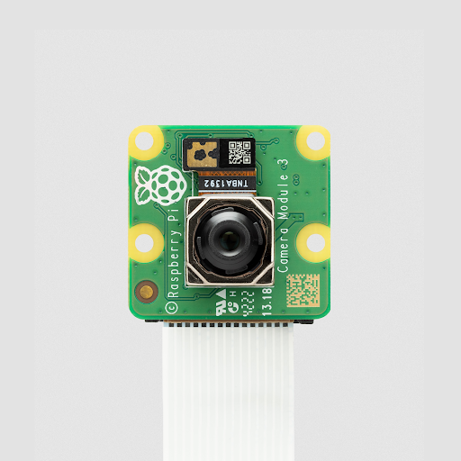

Raspberry Pi 4B 8GB, Picamera 3 + Autofocus. You can even use the latest Raspberry Pi 5 which has more compute power than the Pi 4. The raspberry pi is just a single board computer running a version of debian linux OS. We can interface sensors like a camera and write scripts to take images or videos and store them onboard or run models on the edge.

Motor - 920 kV, 30A ESC 3C Lipo
-------------------------------

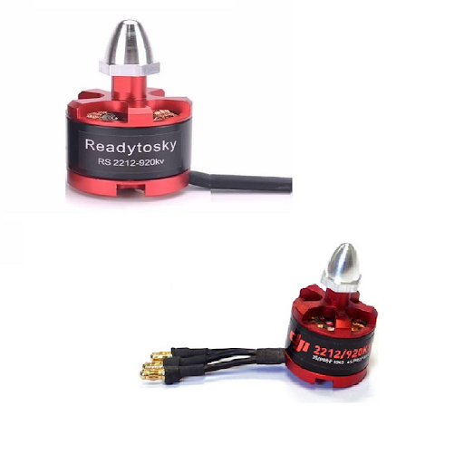
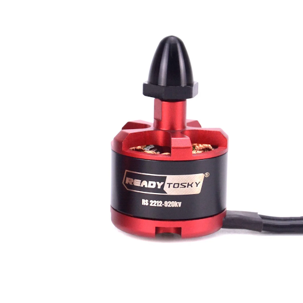
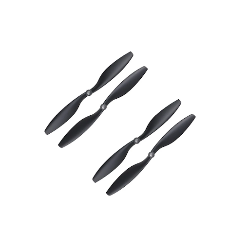

Depending upon payload requirement We should be choosing batteries or different series cell count. The below ones are 2S to 3S Lipo ESC but 2S to 4S lipo will need ESC that can take that voltage and generate more thrust. Props - 1045 10inch diameter and 4.5 inch screw pitch.

5V 5A Buck convertor for Pi 4B
------------------------------

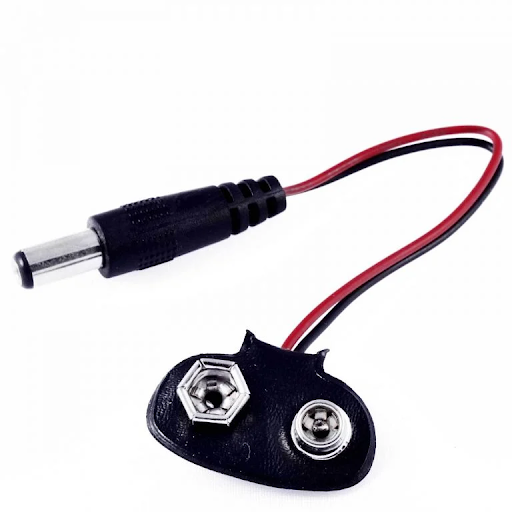
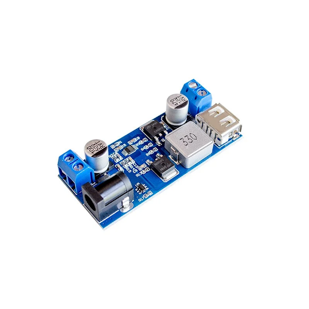
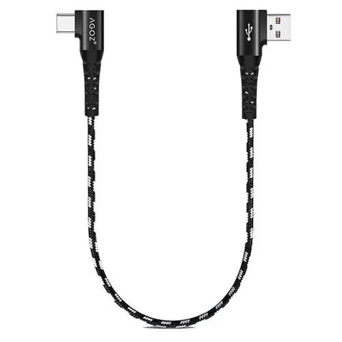

The barrel jack is connected to battery voltage i.e. 10.9 to 12.6 V and the USB output is a 5V 5A output. This can power SBCs like Raspberry Pi 4, Raspberry Pi 5, Nvidia Jetson Nano via the USB port.

Battery
-------

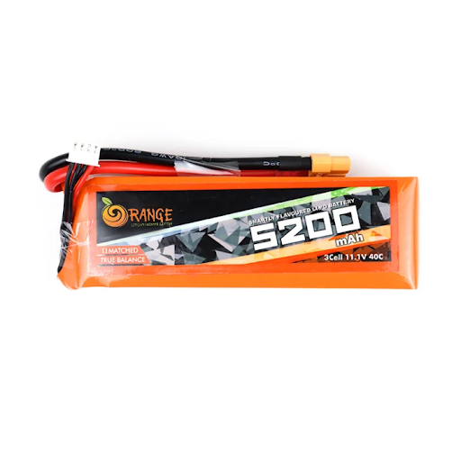

We used a 3S Lipo battery of 5200mAh from Orange company this gives us a brand new 15 mins + hover time. And we can do missions of max length 6 to 7 mins in moderate Winds. We also need a 20cm velcro strap to secure the battery to the frame.

Flight Mode
-----------

We primarily need to know only a few flight modes like Altitude hold,
This Flight mode makes it so that the drone will hold its altitude on 50% throttle but can drift with the wind. Loiter mode takes into account the GPS position as well and makes it so that the drone stays in one location even if it is windy. Return to Launch (RTL) will make the drone come back to Home waypoint first by going to the RTL height and then coming to home and landing.
Land mode just gently lands the drone and switches off the motors on landing. Auto mode sets the drone to start an autonomous mission.

Software
========

Drone firmware - Ardupilot Arducopter (latest)
----------------------------------------------

If in case hardware GPS is not showing satellites or pixhawk readings are not good change to older firmware like 4.0.1
Ardupilot firmware is installed using the mission planner ground control application.
Ardupilot is an open source autopilot firmware for various unmanned vehicles like - multirotors, fixed wing, submarines, rovers, etc. It makes use of the MAVlink - Micro Aerial Vehicle link to communicate between the ground station software and the vehicle autopilot over radio link.
Documentation - https://ardupilot.org/ardupilot/

Raspberry pi os - raspbian 64 bit desktop/GUI version
-----------------------------------------------------

The SD card for the raspberry pi needs to be flashed with the operating system - https://www.raspberrypi.com/software/
The raspberry pi needs to be set up with remote SSH and should connect to a WiFi AP on power on for remote login.
Here is a video - How to Setup a Raspberry Pi and Access it Remotely! (Headless setup)

Ground Control Station - Mission Planner
----------------------------------------

This is a software application for your desktop, android phone. This application helps us upload autopilot firmware to our pixhawk hardware. It also helps with calibrating and setting up the sensors onboard the pixhawk as well as the GPS. We also use this to plan GPS waypoint missions for our autonomous missions.
Mission planner Installation link - https://ardupilot.org/planner/docs/mission-planner-installation.html

Photogrammetry software - Open Drone Map
----------------------------------------

This software helps us make a map from all the RGB survey images we collected. These images can be geotagged or not. When we upload our images to this software we get some options. You can leave it as the default option and it will create a RGB map, height map, and 3d point cloud of the survey area. The way it can get the height details from just RGB images is using the parallax effect.
https://github.com/OpenDroneMap/WebODM
Video of how to setup web ODM with docker on Windows - https://youtu.be/HR4i7ROWlMo?si=TVL1pN_t73j4Dm4I

Step-By-Step Build Guide
========================

Soldering
---------
    * If the ESCs don't come pre-soldered, solder the bullet connector onto them.
      https://youtu.be/tNdO3TJZ3N8?si=piAWnS7TkZyx7zI_
    * Attach the ESC to the PDB (power distribution board) i.e. also the bottom plate of the frame.
      https://youtu.be/YCCexJwHwww?si=LV6hDpl96ZlweH-T
    * Solder the XT60 connector for the battery and the barrel connector onto the frame.
      https://youtu.be/fb1aYwV7SJg?si=UxUOzsyDRiUhCQEx
    * Affix the bottom plate (PDB) of the frame to the arms, ensuring the soldered connections are inside. For quadcopters, position the red arms towards the drone's forward direction.
      https://youtu.be/fb1aYwV7SJg?si=UxUOzsyDRiUhCQEx

Motor and Propeller Installation
--------------------------------
    * Attach the motors to the arms following the propeller rotation convention: Forward right - Counter Clockwise (CCW), Forward left - Clockwise (CW), Backward right - CW, Backward left - CCW. Consider using soft mounts if available.
      https://youtu.be/hNkZ9KcXx2c?si=8g1-t7sXP_akIEEh
    * Once motors are installed, secure the top plate of the frame and attach the GPS stand to it.
      https://youtu.be/fAu5Yjmyc5w?si=2_1SyQDkZOPabSrI
      https://youtu.be/Ut4apTpMLts?si=LXwQtkReUxC-OGCf

Camera Setup
------------
    * Insert the camera flex cable into the CSI port of the Raspberry Pi and connect the other end to the camera.
      https://youtu.be/VzYGDq0D1mw?si=eZQLDXn_JO3SlFE7

Securing Components
-------------------
    * Use zip ties to fasten the ESCs to the frame arms.
      https://youtu.be/Iw7rsEqPqxA?si=6_5Djcio2-d5hL6_
    * Secure the Raspberry Pi with a case using double-sided tape.
    * Place the vibration damper on top of the Raspberry Pi case using double-sided tape.
    * Affix the Pixhawk onto the vibration damper with double-sided tape.
      https://youtu.be/kB9YyG2V-nA?si=Gj4cT7KVVbkmQTus
    * Secure additional components like the receiver, safety switch, buzzer, and telemetry using zip ties and double-sided tape.
      https://youtu.be/DGAB34fJQFc?si=8hRTWqMT_MdT8OyN
      https://youtu.be/JmPtCAqSm_s?si=L2XKtasFz7ZLn-dL
    * Secure the buck converter to the frame using zip ties and double-sided tape.
      https://youtu.be/UdbI2M66cQM?si=gXSSFBcsyRMaBlPz

Electrical Connections
----------------------
    * Connect the barrel connector to the buck converter and the USB-C cable to the buck converter and Raspberry Pi for power.
    * Attach the Pixhawk power module to the XT60 connector on the frame.
    * Connect the wires on the Pixhawk for all components, including GPS, telemetry, power module, safety switch, buzzer, ESCs, and receiver.

Firmware Installation
---------------------
    * Open the Mission Planner and connect the Pixhawk via a USB cable.
    * In the setup section, install the latest version of Arducopter firmware for quadcopter, selecting the Pixhawk 1 board.
    * Complete all mandatory setup and calibration steps. Refer to the provided video for guidance.
      How To Make a Quadcopter Drone Using Pixhawk In Detail || DIY Quadcopter Using Pixhawk
    * Once calibration is complete and any pre-arm issues are resolved, set up desired flight modes on a channel, typically including altitude hold, loiter, and land modes. Pitch channel will need to be reversed. Output format should be ppm. Channel 5 should be mapped to switch with 3 states for flight modes.
      FlySky FS-i6X How to Setup TOP 5 FUNCTIONS for BEGINNER PILOTS

Build Videos
------------
    * Make Your Own Pixhawk Raspberry Pi Drone in 36 Minutes (2020) | The Ultimate Project Drone
    * Ardupilot setup (starts from 10 mins onwards)
    * How To Make a Quadcopter Drone Using Pixhawk In Detail || DIY Quadcopter Using Pixhawk

Build Videos
============
https://youtu.be/kB9YyG2V-nA?si=8iQwBggDfUdD19se
Ardupilot setup (starts from 10 mins onwards)
https://youtu.be/j3sjFCG0vjE?si=yvv0RM1f4Hz7nO5n&t=625

About Project
=============

.. toctree::
   :maxdepth: 2
   :caption: Contents:

Indices and tables
==================

* :ref:`genindex`
* :ref:`modindex`
* :ref:`search`
